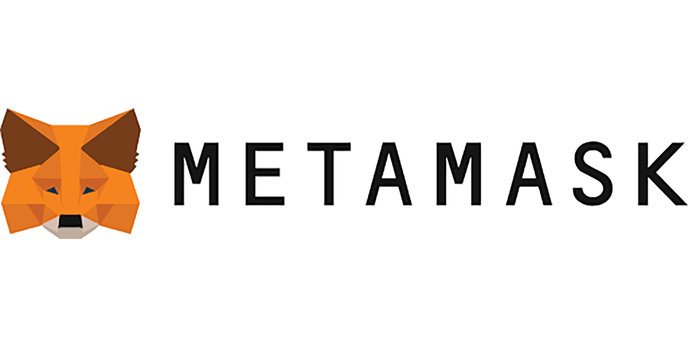
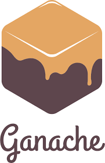
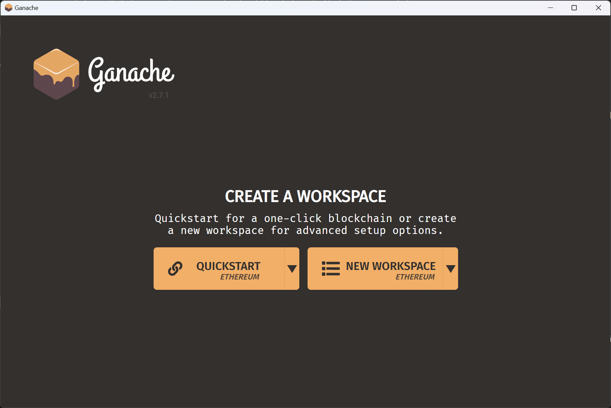
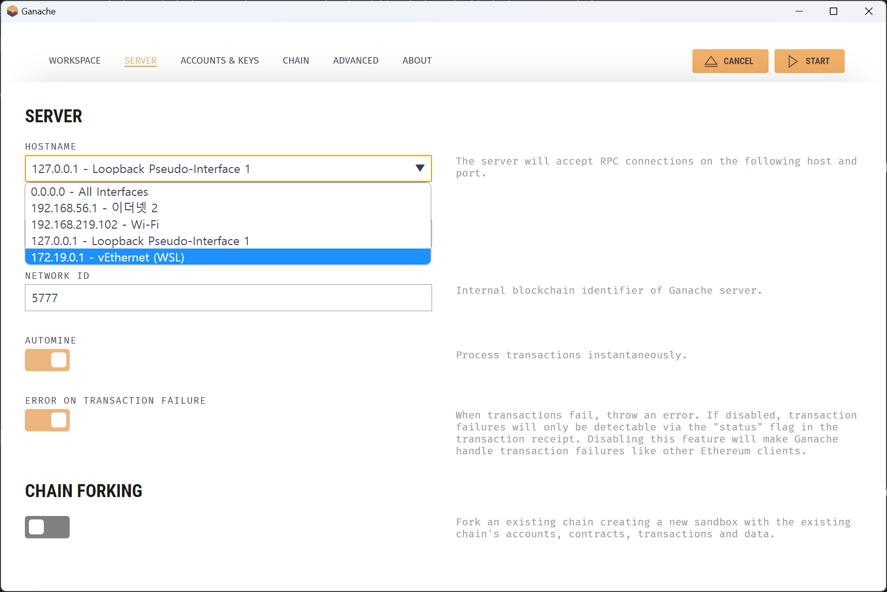
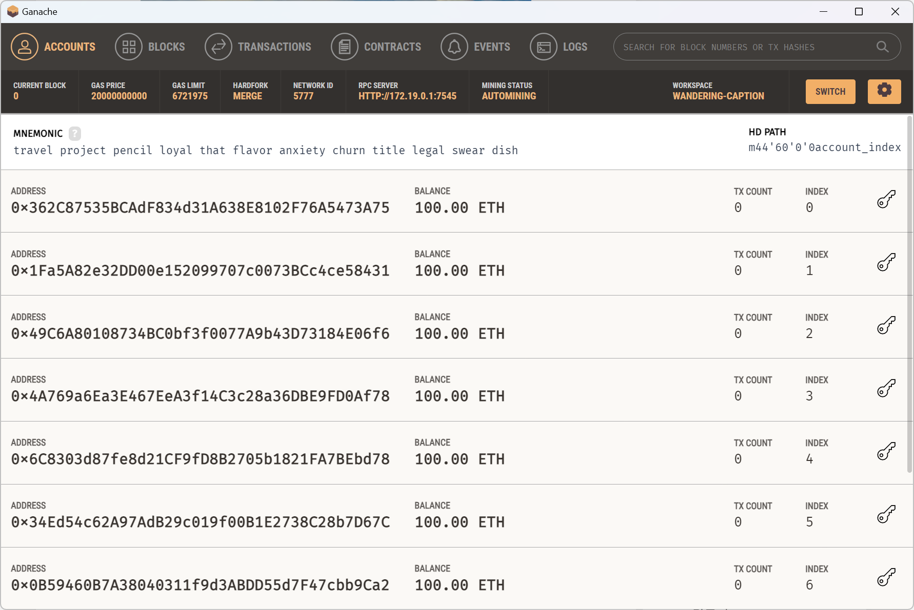
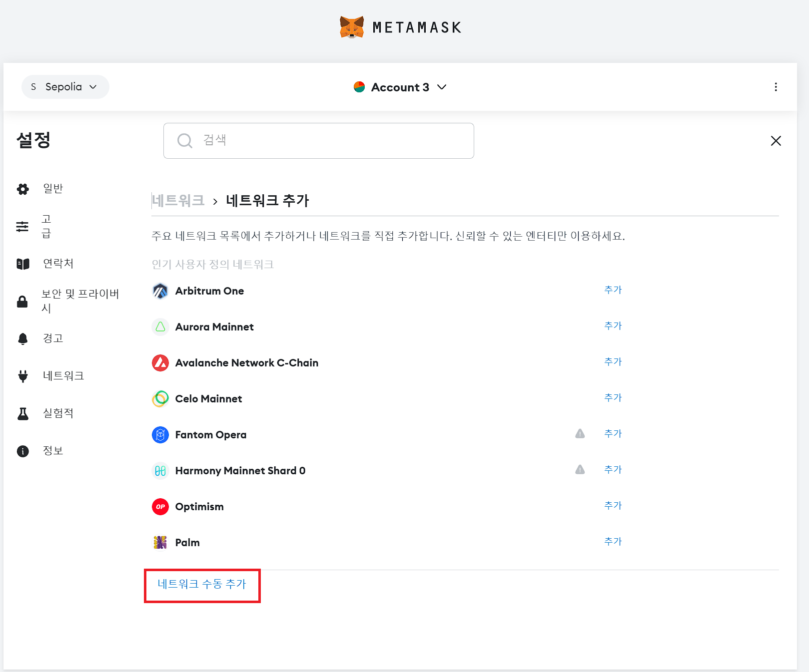
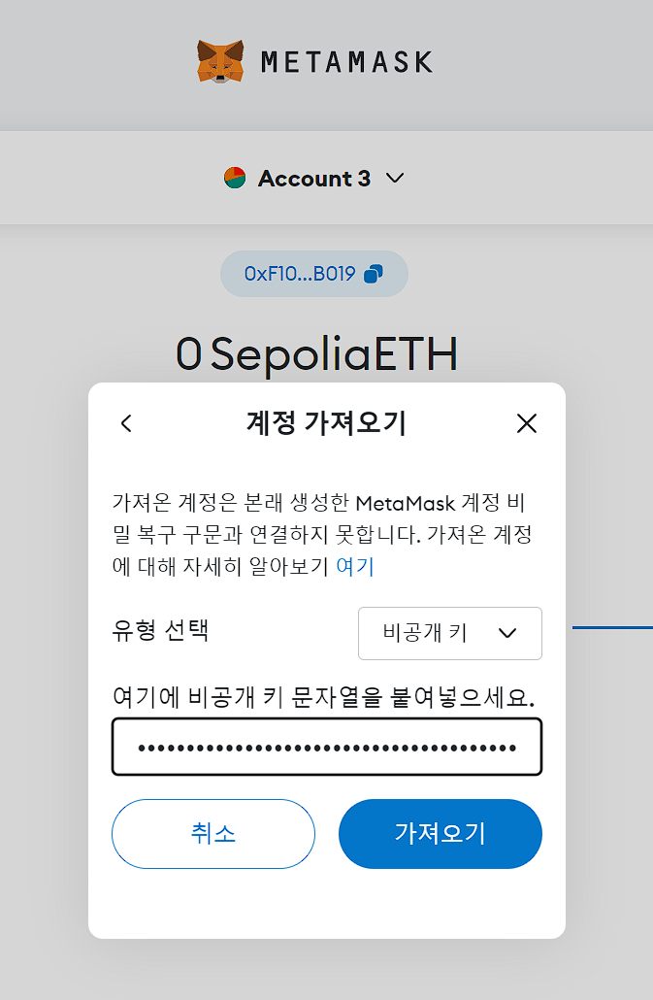
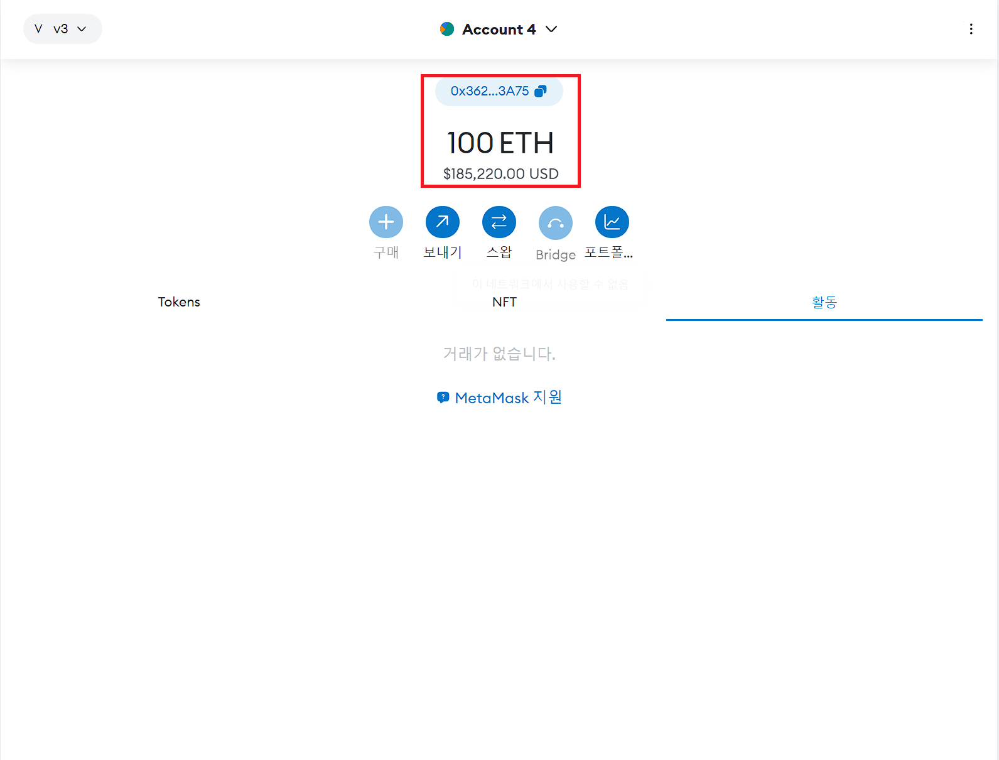
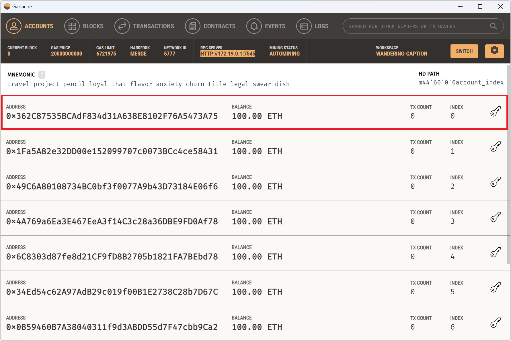

#개요 
블록체인 개발을 처음 입문하시는 분들을 위한 튜토리얼
개발을 위한 환경설정부터 블록체인 핵심기술인 solidy의 기본 문법, 블록체인 지갑인 metamask 생성,
testnet인 ganache 설정, 그리고 프론트엔드 언어인 react를 이용해서 개발의 전 과정을 체험해보며 감을 익힐 수 있게 
도와주는 학습 프로젝트이다. 

이번 프로젝트에서는 lck라는 league of legend 한국 대회의 일정에 따라 사용자가 각각 토큰을 배팅하면 
승패 결과에 따라 정산해주는 애플리케이션 및 웹을 개발해볼 것이다. 

본 과정은 초보자들이 가장 어렵고 까다로워하는 개발 환경 설정과 solidity를 중점적으로 다룰 것이다. 

##vscode

vscode는 프로그래밍의 대표적인 문서 편집기이다. 
본 튜토리얼 과정에서 대부분의 코딩 및 명령어 실행이 해당 프로그램을 통해 이루어진다. 
https://code.visualstudio.com/
해당 사이트에서 본인에게 맞는 실행파일을 설치하면 된다. 

##wsl 

https://gaesae.com/161 의 전과정을 통해 wsl를 설치해준다. 

개발 환경으로써는 window, linux, mac이 대표적이다. 

윈도우에서는 여러 문제점이 발생하므로 (왜?) 

WSL이란 window sub-system for linux의 약자로 윈도우의 가상화 기술을 통해 윈도우에서 리눅스의 명령어 및 기능를 실행 할 수 있게 해준다. 이를 통해 윈도우 개발 환경에서 수월하게 개발환경을 세팅할 수 있다. 

##github 

스타팅 파일 github 링크 (startingFile)

1. 깃 허브에 익숙치 않은 사람은 해당 문서를 참조하시길 바란다. (굳이 할 필요 없기도한 것 같기도)
2. 직접 ZIP 파일을 다운로드 하여 WSL 운영체제에서 압축을 푼다. 

##의존성 설치 
이제 해당 로컬 컴퓨터에 전역적으로 혹은, 해당 디렉토리에서 필요한 패키지들을 설치하는 과정이다. 

###1-1
ubuntu terminal을 연다. 

cd startingFile을 통해 디렉토리에 접근한다.

    cd ~
    cd startingFile

###1-2

    sudo apt-get update
    sudo apt-get upgrade
    sudo apt-get install curl
    sudo apt-get install build-essential libssl-dev
    curl -o- https://raw.githubusercontent.com/nvm-sh/nvm/v0.34.0/install.sh | bash

시스템의 패키지 목록을 최신으로 업데이트 하고 필요한 nvm 및 패키지를 설치하는 과정

###1-3

    nvm install -lts
    nvm use 14
    nvm install node
    npm install -g truffle

node는 애플리케이션 구축을 목적으로 설계된 Javascript 환경이다. 
nvm과 npm은 node의 필요한 패키지들을 간편하게 설치하고 관리할 수 있는 cli도구이다. 
truffle 이더리움 기반의 스마트 컨트랙트를 개발하고 배포할 수있도록 도와주는 프레임 워크이다.

    truffle version 

이라는 명령어를 통해 truffle이 잘 설치 되었는지 확인해 볼 수 있다. 

##metamask 

메타마스크는 이더리움 개인지갑을 편리하고 안전하게 관리 할 수 있는 구글 확장 프로그램이다. 
아이디를 로그인한다. 

##ganache

가나슈는 PC에 설치 가능한 블록체인 테스트넷 환경이다. 이를 통해 복잡한 절차 없이 블록체인을 테스트넷에 배포해보고 
실험해볼 수 있다. 

https://trufflesuite.com/ganache/

###1-1. 가나슈를 실행하여 workspace에 들어간다.

###1-2. server에서 hostname을 WSL버전으로 바꿔준다. 

가나슈 설명란, 10개의 지갑이 보인다. 

###1-3. RFC SERVER의 IP주소를 복사 해둔다.

###1-4. NETWORK 추가를 누른뒤, 네트워크 수동추가를 눌러준다.

###1-5. 네트워크 이름을 설정하고, 아까 복사했던 주소를 RFC SERVER란에 붙여넣어준다. 나머지는 위의 이미지와 동일하게 작성해준뒤 저장을 누른다.  

###1-6. 가나슈 설정 창의 첫번째 지갑의 열쇠 모양을 클릭하고 개인키를 복사해준다. 

###1-7. 위의 ACCOUNT를 누른 뒤, 계정 가져오기를 클릭한다. 

###1-8. 빈 칸란에 아까 복사해둔 개인키를 붙여넣고 가져오기를 클릭한다. 

###1-9. 아까 설정했던 네트워크 및 계정을 설정하면 가나슈의 첫번째 계정 정보를 메타마스크에서 확인 할 수 있다. 

##truffle-config.js 설정 
truffle-config.js는 truffle이라는 프레임워크를 사용할 경우 설정해야하는 파일입니다. 
truffle을 통해 스마트 컨트랙트를 컴파일하고, 사용하는 테스트넷에 배포할 수 있습니다. 
각각의 필요한 세부사항을 살펴보겠습니다. 

    module.exports = {
        networks: {},
        contracts_directory: ,
        contracts_build_directory:,
        migrations_directory:,
        tests_directory:,
        compilers: {}
    }

해당 구조가 기본 코드의 틀이라고 할 수 있습니다. 
networks 파트를 먼저 보겠습니다. 
아까 위의 가나슈 설정 파트에서 사용했던 테스트 넷 RFC 주소를 참고하여 작성합니다. 

    networks: {
        development: {
        host: "XXX.XXX.XXX.XXX",     // Ganache 앱을 실행 중인 로컬 호스트
        port: 7545,            // Ganache 앱에서 사용하는 포트 번호 (기본값은 7545)
        network_id: "*",        // 모든 네트워크에 대해 설정
        },
    },
    
XXX.XXX.XXX.XXX:7545 이라는 테스트 넷에 접속하여, 테스트 넷의 네트워크 id와 상관없이 연결을 하겠다는 코드입니다. 

    contracts_directory: './src/contracts/',
    contracts_build_directory: './src/truffle_abis/',
    migrations_directory: './migrations/',
    tests_directory: './test/',

해당 디렉토리 중 컨트랙트가 보관되어 있는 디렉토리, 컴파일 시 생성되는 파일에 대한 디렉토리, migrations 설정이 들어있는 디렉토리, 그리고 test를 사용할 때 필요한 파일을 담은 디렉토리의 위치를 설정해주는 코드입니다. 

    compilers: {
        solc: {
        version: '0.8.18',
        optimizer: {
            enabled: true,
            runs: 200
        },
        }
    }

해당 코드는 solidity언어를 compile할 compiler의 정보를 설정하는 코드입니다. 
version은 compiler가 사용할 solidiy의 버전을
optimizer의 enable은 컴파일러 실행 속도 및 가스 비용을 줄일 수 있는 기능입니다. 
run은 해당 기능이 활성화 되었을 경우, 계약이 자주 호출된다면 높은 값을, 그렇지 않다면 낮은 값을 설정하는게 
유리합니다. 

아래의 코드는 truffle-config.js 파일의 코드 전체입니다. 

    module.exports = {
    networks: {
        development: {
        host: "192.168.96.1",     
        port: 7545,            
        network_id: "*",        
        },
    },
    contracts_directory: './src/contracts/',
    contracts_build_directory: './src/truffle_abis/',
    migrations_directory: './migrations/',
    tests_directory: './test/',
    compilers: {
        solc: {
        version: '0.8.18',
        optimizer: {
            enabled: true,
            runs: 200
        },
        }
    }
    }

만일 가나슈의 워크 스페이스를 계속 실행하며 테스트 넷 RFC server 주소가 바뀐다면 
network의 host의 값을 계속해서 변경해야 제대로 deploy가 될 수 있습니다. 

##solidy
##react 

